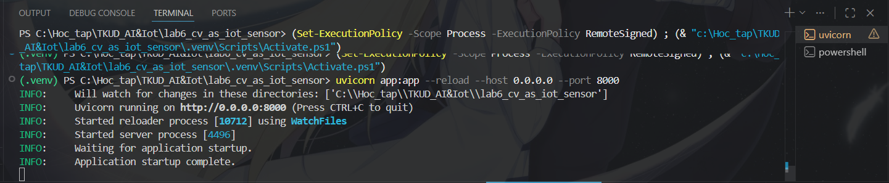
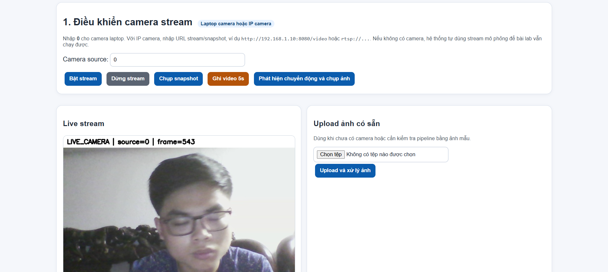
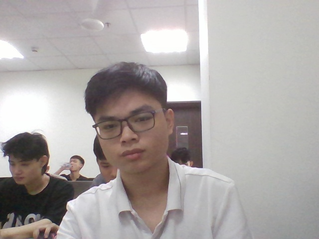
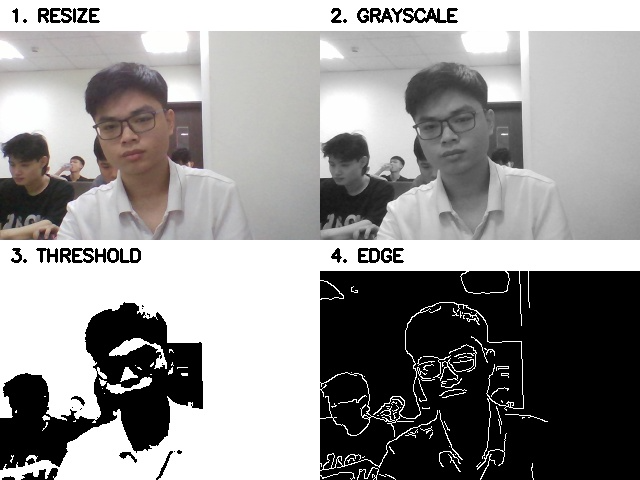
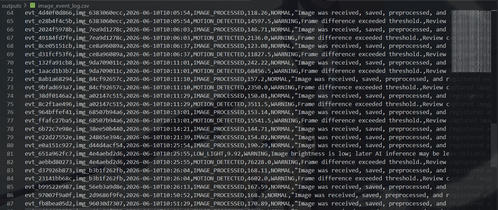

# Lab 6 - Computer Vision as IoT Sensor

Lab này đưa camera/ảnh vào hệ thống AIoT như một cảm biến trực quan. Mục tiêu là chạy được live stream, chụp ảnh, ghi video, phát hiện chuyển động, xử lý ảnh cơ bản, ghi metadata, sinh event và quan sát trên dashboard HTML.

## Cấu trúc file chính

```text
app.py              # backend FastAPI: stream, snapshot, video, motion, preprocess, metadata, event
index.html          # giao diện dashboard: stream, upload ảnh, quan sát ảnh/metadata/event
run_lab6_demo.py    # chạy thử nhanh không cần camera thật
```

## Chạy nhanh

```bash
python -m venv .venv
# Windows
.venv\Scriptsctivate
# macOS/Linux/WSL
source .venv/bin/activate
pip install -r requirements.txt
python run_lab6_demo.py
uvicorn app:app --reload --host 0.0.0.0 --port 8000
```

Mở trình duyệt:

```text
http://127.0.0.1:8000/
http://127.0.0.1:8000/docs
```

## Cần quan sát sau khi chạy

- `data/raw_images/`: ảnh gốc từ upload/snapshot/motion.
- `data/processed_images/`: ảnh tổng hợp bốn bước xử lý.
- `data/videos/`: video ngắn ghi từ camera hoặc stream mô phỏng.
- `outputs/image_metadata.csv`: metadata của ảnh.
- `outputs/image_event_log.csv`: event sinh từ ảnh/camera.
- Dashboard tại `/`: live stream, ảnh gốc, ảnh xử lý, bảng metadata và event.

  # Lab 6: Computer Vision as IoT Sensor

## Overview

This project demonstrates how a camera can be treated as an IoT sensor within an AIoT system. Instead of producing traditional telemetry data such as temperature or humidity, the camera generates visual data that is processed, analyzed, logged, and transformed into operational events.

The system provides a web dashboard for monitoring camera streams, capturing snapshots, recording videos, detecting motion, and managing image metadata and events.

---

## Objectives

* Understand the role of computer vision in AIoT systems.
* Treat image data as sensor data.
* Capture and process images from a camera stream.
* Generate metadata from captured images.
* Generate visual events for monitoring and operation.
* Visualize the complete image pipeline through a dashboard.

---

## System Architecture

```text
Camera Stream
      │
      ▼
Image Acquisition
      │
      ▼
Image Processing
(Resize → Grayscale → Threshold → Edge)
      │
      ▼
Metadata Generation
      │
      ▼
Event Generation
      │
      ▼
Dashboard Visualization
```

---

## Technologies Used

* Python
* FastAPI
* OpenCV
* Pillow (PIL)
* HTML
* JavaScript

---

## Project Structure

```text
lab6_cv_as_iot_sensor/
│
├── app.py
├── index.html
├── run_lab6_demo.py
│
├── data/
│   ├── raw_images/
│   ├── processed_images/
│   └── videos/
│
├── outputs/
│   ├── image_metadata.csv
│   └── image_event_log.csv
│
├── docs/
│   └── screenshots/
│
└── README.md
```

---

## Features

### Live Camera Stream

* Supports laptop webcam.
* Supports IP camera.
* Supports simulated stream mode.

### Snapshot Capture

Captured images are stored in:

```text
data/raw_images/
```

### Image Processing Pipeline

Each captured image is processed through four stages:

1. Resize
2. Grayscale Conversion
3. Thresholding
4. Edge Detection

Processed outputs are stored in:

```text
data/processed_images/
```

### Metadata Logging

Image information is recorded in:

```text
outputs/image_metadata.csv
```

Example metadata:

* Filename
* Timestamp
* Width
* Height
* Image Size

### Event Logging

Visual events are recorded in:

```text
outputs/image_event_log.csv
```

Example events:

* SNAPSHOT_CAPTURED
* IMAGE_UPLOADED
* VIDEO_RECORDED
* MOTION_DETECTED
* NO_SIGNIFICANT_MOTION

### Video Recording

Short videos can be recorded and stored in:

```text
data/videos/
```

### Motion Detection

The system compares consecutive frames to detect movement and generate events.

---

## Installation

Create a virtual environment:

```bash
python -m venv .venv
```

Activate environment:

### Windows

```bash
.venv\Scripts\activate
```

### Linux / macOS

```bash
source .venv/bin/activate
```

Install dependencies:

```bash
pip install -r requirements.txt
```

---

## Run Demo Mode

```bash
python run_lab6_demo.py
```

This mode allows testing without a physical camera.

---

## Run Dashboard

```bash
uvicorn app:app --reload --host 0.0.0.0 --port 8000
```

Open:

```text
http://127.0.0.1:8000
```

---

## Results

### Dashboard



### Live Stream



### Snapshot Capture



### Image Processing



### Metadata Log


### Event Log



---

## Learning Outcomes

After completing this project, I was able to:

* Understand how cameras function as IoT sensors.
* Build an image acquisition pipeline using FastAPI and OpenCV.
* Generate metadata from visual data.
* Create event-driven monitoring workflows.
* Prepare image data for future object detection systems.

---

## Future Development

This project serves as the foundation for the next AIoT stage:

* Object Detection
* Image Classification
* Bounding Box Visualization
* Confidence Scoring
* Intelligent Visual Event Generation

---

## Author

AIoT Deployment Pipeline - Lab 6
Computer Vision as IoT Sensor

